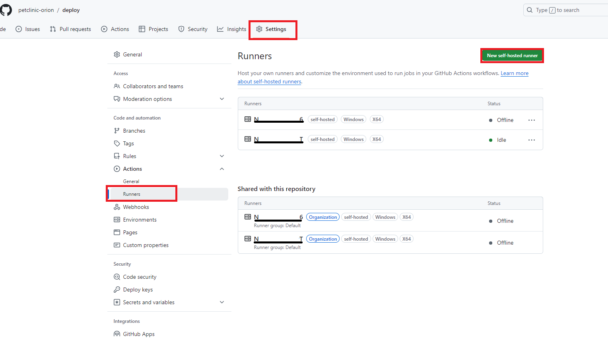
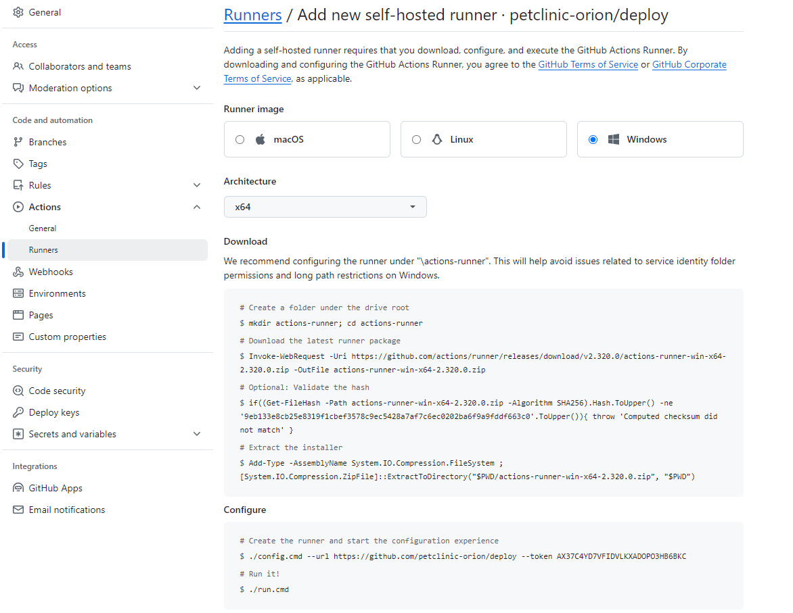
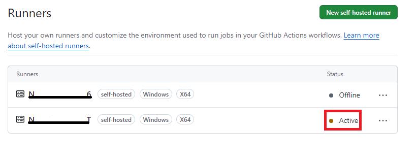

# Init Submodules/Services 
`git submodule init `
`git submodule update 
git submodule update --recursive --remote` 

pull single service example git submodule update --remote --merge auth-service 

# GITHUB ACTIONS

You should add self-hosted runner under the relevant repositories. If you add it under organization you will get an error.

Settings > Actions > Runners > New self-hosted runner




Open Powershell and run commands. 

Reference: https://github.com/petclinic-orion/deploy/settings/actions/runners/new

If you get the following error about the policy, run this command
``...running scripts is disabled on this system. For more information, see about_Execution_Policies at...``
``PS C:\Users\<<user>>\actions-runner> Set-ExecutionPolicy RemoteSigned``


````
PS C:\Users\<<user>>> mkdir actions-runner; cd actions-runner                                                                

    Directory: C:\Users\<<user>>


Mode                 LastWriteTime         Length Name
----                 -------------         ------ ----
d-----        10/15/2024   2:31 PM                actions-runner


PS C:\Users\<<user>>\actions-runner> Invoke-WebRequest -Uri https://github.com/actions/runner/releases/download/v2.320.0/actions-runner-win-x64-2.320.0.zip -OutFile actions-runner-win-x64-2.320.0.zip
PS C:\Users\<<user>>\actions-runner> if((Get-FileHash -Path actions-runner-win-x64-2.320.0.zip -Algorithm SHA256).Hash.ToUpper() -ne '9eb133e8cb25e8319f1cbef3578c9ec5428a7af7c6ec0202ba6f9a9fddf663c0'.ToUpper()){ throw 'Computed checksum did not match' }
PS C:\Users\<<user>>\actions-runner> Add-Type -AssemblyName System.IO.Compression.FileSystem ; [System.IO.Compression.ZipFile]::ExtractToDirectory("$PWD/actions-runner-win-x64-2.320.0.zip", "$PWD")
PS C:\Users\<<user>>\actions-runner> ./config.cmd --url https://github.com/petclinic-orion/deploy --token AX37C44D4KHOMLGHK32WPZTHBZQHO

--------------------------------------------------------------------------------
|        ____ _ _   _   _       _          _        _   _                      |
|       / ___(_) |_| | | |_   _| |__      / \   ___| |_(_) ___  _ __  ___      |
|      | |  _| | __| |_| | | | | '_ \    / _ \ / __| __| |/ _ \| '_ \/ __|     |
|      | |_| | | |_|  _  | |_| | |_) |  / ___ \ (__| |_| | (_) | | | \__ \     |
|       \____|_|\__|_| |_|\__,_|_.__/  /_/   \_\___|\__|_|\___/|_| |_|___/     |
|                                                                              |
|                       Self-hosted runner registration                        |
|                                                                              |
--------------------------------------------------------------------------------

# Authentication


√ Connected to GitHub

# Runner Registration

Enter the name of the runner group to add this runner to: [press Enter for Default]

Enter the name of runner: [press Enter for NRD5CG219499T]

This runner will have the following labels: 'self-hosted', 'Windows', 'X64'
Enter any additional labels (ex. label-1,label-2): [press Enter to skip]

√ Runner successfully added
√ Runner connection is good

# Runner settings

Enter name of work folder: [press Enter for _work]

√ Settings Saved.

Would you like to run the runner as service? (Y/N) [press Enter for N] Y
User account to use for the service [press Enter for NT AUTHORITY\NETWORK SERVICE]
Granting file permissions to 'NT AUTHORITY\NETWORK SERVICE'.
Service actions.runner.petclinic-orion-deploy.NRD5CG219499T successfully installed
Service actions.runner.petclinic-orion-deploy.NRD5CG219499T successfully set recovery option
Service actions.runner.petclinic-orion-deploy.NRD5CG219499T successfully set to delayed auto start
Service actions.runner.petclinic-orion-deploy.NRD5CG219499T successfully configured
Waiting for service to start...
Service actions.runner.petclinic-orion-deploy.NRD5CG219499T started successfully
PS C:\Users\<<user>>\actions-runner>
PS C:\Users\<<user>>\actions-runner> ./run.cmd
        1 file(s) copied.

√ Connected to GitHub

Current runner version: '2.320.0'
2024-10-15 11:35:46Z: Listening for Jobs
2024-10-15 11:35:51Z: Running job: compose-up
2024-10-15 11:36:12Z: Job compose-up completed with result: Failed
2024-10-15 11:38:39Z: Running job: compose-up
2024-10-15 11:39:01Z: Job compose-up completed with result: Failed
Exiting...
Terminate batch job (Y/N)? Y
PS C:\Users\<<user>>\actions-runner> Set-ExecutionPolicy RemoteSigned
PS C:\Users\<<user>>\actions-runner> ./run.cmd
        1 file(s) copied.

√ Connected to GitHub

````

You should see the name of your own computer here. It should be active. 



good bye world